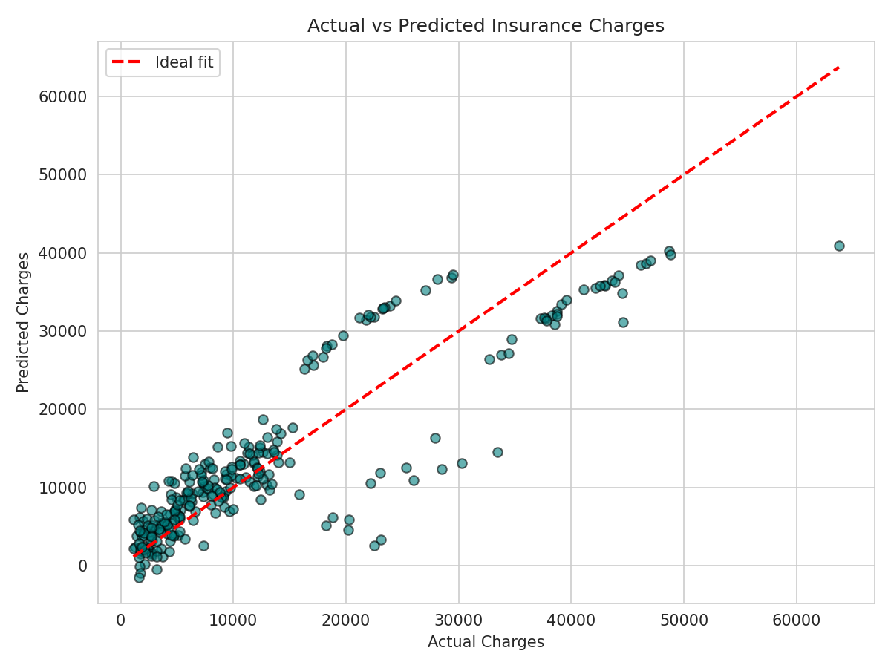

# Medical Insurance Charges Prediction — Multiple Linear Regression

## Objective
An insurance company wants to estimate the medical insurance charges of customers based on their personal and health-related information. This project builds a **Multiple Linear Regression** model to predict insurance `charges` using features such as age, sex, BMI, number of children, smoker status, and region.

## Dataset
- **Name:** Medical Cost Personal Datasets
- **Source:** [Kaggle — mirichoi0218/insurance](https://www.kaggle.com/datasets/mirichoi0218/insurance)
- **Records:** 1,338
- **Features:** `age`, `sex`, `bmi`, `children`, `smoker`, `region`
- **Target:** `charges`

> Note: The raw dataset is **not included** in this repository (see [Submission Instructions] policy on redistribution). Please download `insurance.csv` from the Kaggle link above and place it in the `data/` folder before running the notebook.

## Libraries Used
- `pandas` — data loading and manipulation
- `numpy` — numerical operations
- `matplotlib`, `seaborn` — data visualization
- `scikit-learn` — train/test split, LabelEncoder, LinearRegression, evaluation metrics

## Methodology
1. **Data Understanding** — Loaded the dataset with Pandas, inspected the first five records, and identified numerical features (`age`, `bmi`, `children`), categorical features (`sex`, `smoker`, `region`), and the target variable (`charges`).
2. **Data Preprocessing**
   - Checked for missing values and duplicate rows.
   - Encoded categorical variables: `sex` and `smoker` via Label Encoding, `region` via One-Hot Encoding.
   - Split the data into 80% training and 20% testing sets (`random_state=42`).
3. **Model Development** — Trained a `LinearRegression` model (scikit-learn) on the training set using all six features, then predicted charges on the test set.
4. **Model Evaluation** — Evaluated predictions using MAE, MSE, RMSE, and R² score, and visualized results with an Actual vs Predicted scatter plot.

## Results

| Metric | Value |
|---|---|
| MAE | 4181.19 |
| MSE | 33,596,915.85 |
| RMSE | 5796.28 |
| R² Score | 0.7836 |

**Actual vs Predicted Charges:**



**Observations:**
1. The model explains roughly **78%** of the variance in insurance charges (R² ≈ 0.78), indicating a reasonably strong linear fit overall.
2. `smoker` status is by far the strongest predictor of charges, followed by `age` and `bmi`; `sex` and `region` have comparatively minor effects.
3. The model under-predicts charges for high-cost smokers with high BMI, suggesting the true relationship has a non-linear (interaction) component that plain linear regression cannot fully capture.

## Conclusion
The Multiple Linear Regression model reasonably predicts medical insurance charges using demographic and health-related features. **Smoking status** is the most influential factor, followed by **age** and **BMI**, while **sex** and **region** have a comparatively minor effect. Smokers with higher BMI tend to incur substantially higher medical costs, reflecting the real-world link between lifestyle/health risk and healthcare expenditure. A key **limitation of Linear Regression** here is its assumption of a linear relationship between features and the target — the interaction between smoking and BMI produces a sharp, non-linear jump in charges that this model under-predicts for high-cost cases. Non-linear approaches (Polynomial Regression, Random Forest, Gradient Boosting) could better capture such interactions and improve accuracy.

## Repository Structure
```
.
├── Assignment-1.ipynb      # Main notebook (Tasks 1–5)
├── README.md
├── requirements.txt
├── images/
│   └── actual_vs_predicted.png
└── data/                   # (not included — download insurance.csv from Kaggle here)
```

## How to Run
```bash
pip install -r requirements.txt
# Download insurance.csv from the Kaggle link above into the data/ folder
jupyter notebook Assignment-1.ipynb
```
