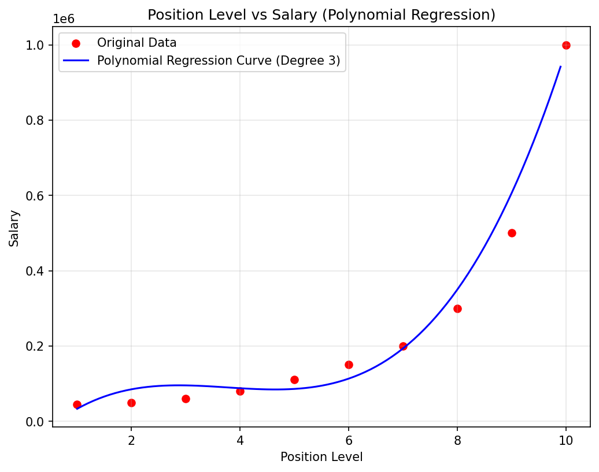

# Assignment 3 — Polynomial Regression: Position Salaries

## Objective
A company wants to estimate the salary of employees based on their position level. Since the relationship between position level and salary is non-linear, this project develops a **Polynomial Regression** model (degree = 3) to predict employee salaries from position level.

## Dataset Link
[Position Salaries Dataset — Kaggle](https://www.kaggle.com/datasets/akram24/position-salaries)

> **Note:** The dataset (`Position_Salaries.csv`) is not included in this repository. Please download it from the Kaggle link above and place it in this folder before running the notebook/script.

## Libraries Used
- `pandas` — data loading and manipulation
- `numpy` — numerical operations
- `matplotlib` — data visualization
- `scikit-learn` — `train_test_split`, `PolynomialFeatures`, `LinearRegression`, evaluation metrics

## Methodology
1. **Data Understanding:** Loaded the dataset, inspected the first five records, identified `Level` as the input feature and `Salary` as the target variable, and reviewed dataset info/summary statistics.
2. **Data Preprocessing:** Checked for missing values (none found), selected `Level` as `X` and `Salary` as `y`, and split the data into 80% training / 20% testing sets.
3. **Model Development:** Transformed the input feature using `PolynomialFeatures(degree=3)`, trained a `LinearRegression` model on the transformed features, and generated predictions on the test set.
4. **Model Evaluation:** Evaluated the model using MAE, MSE, and R² Score, and visualized the original data alongside the fitted polynomial regression curve.

## Results

| Metric | Value |
|---|---|
| MAE | 70,635.25 |
| MSE | 6,263,853,282.86 |
| R² Score | 0.8763 |

**Observations:**
1. The degree-3 polynomial curve fits the non-linear salary growth across position levels far better than a straight line would, especially capturing the steep rise at senior levels (e.g., Partner, C-level, CEO).
2. With only 10 rows in the dataset, the 80/20 split leaves just 2 samples for testing, so the MAE/MSE/R² values can vary considerably depending on which points fall into the test set — the metrics are indicative rather than statistically robust.
3. The model predicts salaries reasonably well for mid-range levels, but extrapolation beyond the observed level range would be unreliable, since polynomial curves can swing sharply outside the training data.

## Conclusion
This project applied Polynomial Regression (degree 3) to model the relationship between position level and salary, since the salary data grows non-linearly and accelerates sharply at senior levels — a pattern a straight line cannot capture. After preprocessing the data, splitting it into training and test sets, and fitting the polynomial model, the resulting curve closely tracked the actual salary progression, and the evaluation metrics (MAE, MSE, R²) confirmed a strong fit relative to a linear alternative.

The key difference between Linear and Polynomial Regression is that Linear Regression fits a single straight line to the data (assuming a constant rate of change), while Polynomial Regression fits a curved line by adding higher-degree terms of the input feature, allowing it to model non-constant, accelerating or decelerating relationships.

The main advantage of Polynomial Regression for this dataset is its ability to capture the rapid, non-linear jump in salary at higher position levels, which a linear model would systematically underestimate.

## Files in this Folder
- `Assignment-3.ipynb` — Jupyter notebook with full code, outputs, and plots
- `Assignment-3.py` — Python script version of the same code
- `polynomial_regression_plot.png` — Saved scatter plot + regression curve
- `README.md` — This file
